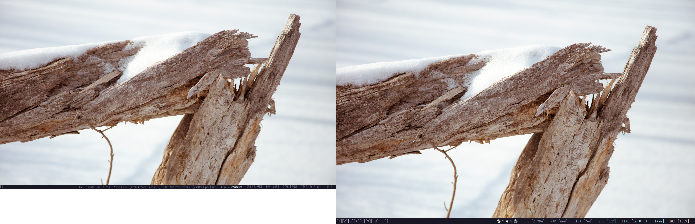

J'utilise Arch Linux en passant

---

# dev setup;

| Directoire | Informations                              |
| :--------: | :---------------------------------------- |
|    env     | dotfiles                                  |
|    cmds    | commandes pour installer certaines choses |
| resources  | quelques ressources dont j'ai besoin      |
|  scripts   | scripts utiles                            |
|    root    | choses configurées en root                |

### Wallpapers

Les fonds d'écrans peuvent être trouvés ici: https://codeberg.org/winterl/wallpapers

### keyboard layout

Check the [.xkb file](root/usr/share/xkeyboard-config-2/symbols/ca)
